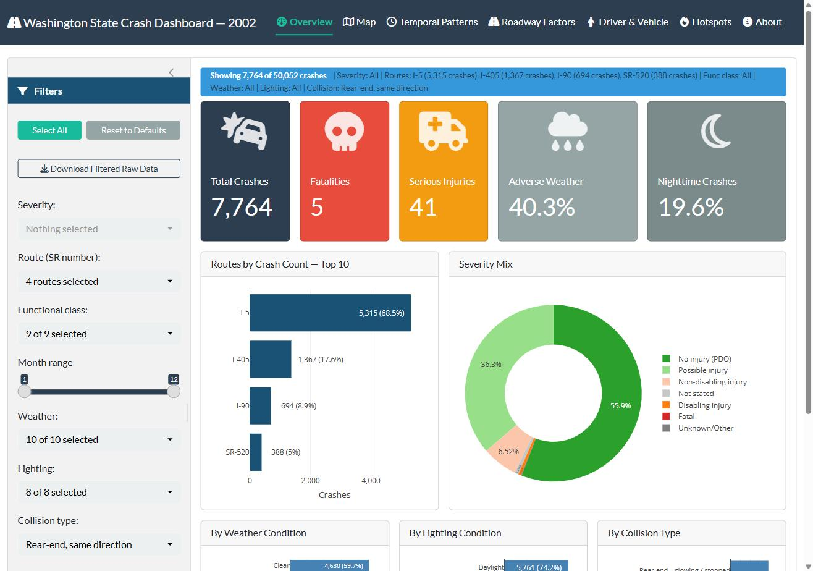

# Washington State Crash Analysis Dashboard

An interactive R Shiny dashboard for exploring statewide crash patterns in Washington using 2002 HSIS data (~50K crashes, ~85K vehicle records, ~45K roadway segments). Built as the term project for CE 465/565 Traffic Engineering and Operations at the University of Arizona.

**Live app:** https://moin1928.shinyapps.io/Crash_Dashboard/

<!-- Add a screenshot: save it as figures/dashboard.png, then uncomment the line below -->
<!--  -->

## Features
- **Overview:** summary of rear-end crashes by severity, time, and location
- **Map:** geocoded crashes on the state route network with filters and clustering
- **Temporal Patterns:** crashes by month, day of week, and hour
- **Roadway Factors:** crash distribution by AADT, lanes, speed limit, and roadway type
- **Driver & Vehicle:** driver age, vehicle type, and vehicle condition breakdowns
- **Hotspots:** EPDO-ranked 0.5-mile segments with a profile panel linked to the map
- **About:** data sources and methodology

## Methods
- **Data pipeline:** accident, vehicle, and roadway tables queried from SQL Server and cached locally as RDS files
- **Linear referencing:** ~99.95% of crashes geocoded to the WSDOT 2002 state route network using route milepost (ARM)
- **Roadway enrichment:** non-equi range join attaches AADT and roadway attributes to ~92% of crashes
- **Hotspot screening:** 0.5-mile sliding windows ranked by Equivalent Property Damage Only (EPDO) score using HSM severity weights (542 / 11 / 3 / 1)

## Tech stack
R · Shiny (bslib, shinydashboard) · leaflet · plotly · sf · data.table · SQL Server

## Project structure
```
app.R        Shiny app (UI + server)
R/           data preparation and helper functions
data/        raw data (not included, see data/README.md)
figures/     screenshots used in this README
```

## Running locally
```r
install.packages(c("shiny", "bslib", "shinydashboard", "leaflet", "plotly", "sf", "data.table"))
shiny::runApp()
```
The HSIS data must be requested separately; see [data/README.md](data/README.md).

## Team
Developed by Moin Morshed and Yeji Jeon for CE 465/565 (instructors: Dr. Pramesh Pudasaini and Dr. Yao-Jan Wu), University of Arizona.
